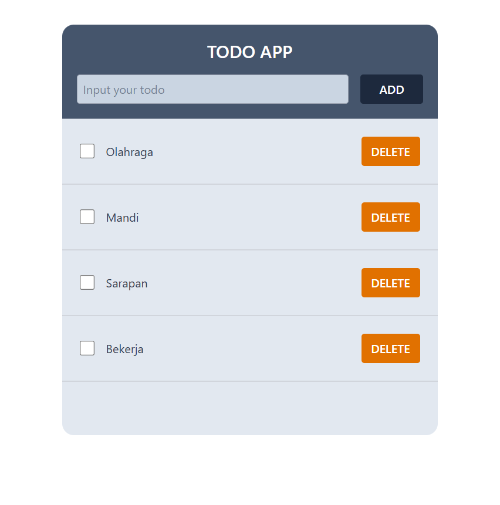

# React Example Project

This repository contains React project Minitask with React useContext example. This project is about creating a todo list application

## Preview



## How to Run

### Manual

1. Clone this project

```bash
git clone https://github.com/yusufbahtiarr/fgo24-react-todo.git
```

2. Enter the project directory

```bash
cd fgo24-react-todo
```

3. Install the Depedencies

```bash
npm install
```

4. Run the project

```bash
npm run dev
```

5. Project will running on http://localhost:8080

### With Docker

1. Clone this project

```bash
git clone https://github.com/yusufbahtiarr/fgo24-react-todo.git
```

2. Enter the project directory

```bash
cd fgo24-react-todo
```

3. Build image

```bash
docker build. -t todoapp:latest
```

4. Run image with docker

```bash
docker run -p 8080:80 -d todoapp:latest
```

5. Visit your app in http://localhost:8080

## Dependencies

This project using nodejs to run, so make sure to install node on your machine.

- live-server: to mock http server in local environtment

## How to Contribute

Please open PR to contributed to this project, i will review and merge if its needed.

## License

This project following MIT License

## Copyright

&copy; 2025 Kodacademy
